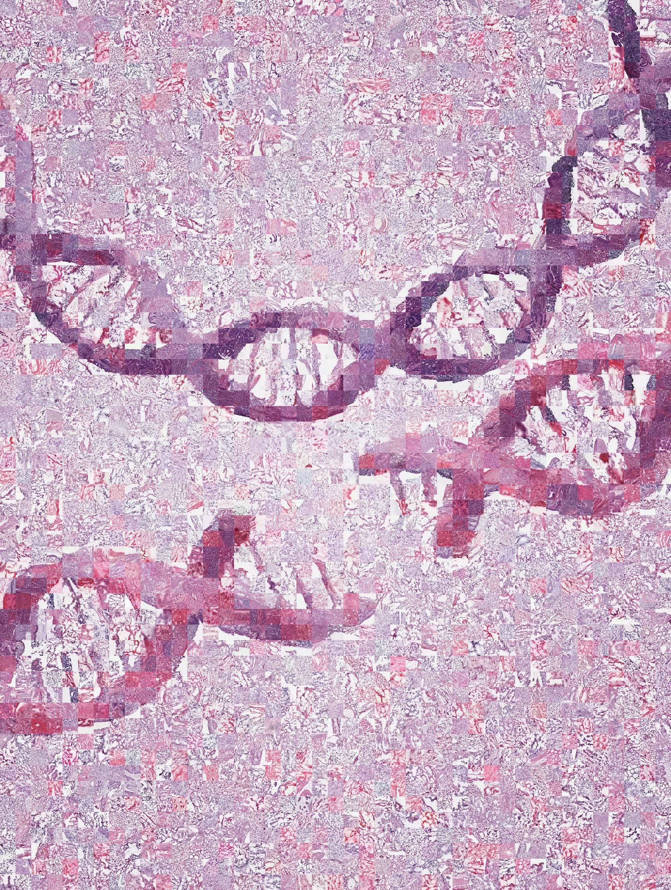

# Mosaic

This utility can be used to generate [photo-mosaic](http://en.wikipedia.org/wiki/Photographic_mosaic) images. It is based on a pixel by pixel mean squared error to match tiles to a reference image. 

## Prerequisites
```python
pip install scikit-image numpy pillow tqdm
```

## Usage
```python
import mosaic
create_mosaic(
    subject="/path/to/source/image", 
    target="/path/to/output/image", 
    tile_paths=["/path/to/tile_1" , ... "/path/to/tile_n"],
    tile_ratio=1920/800, # Crop tiles to be height/width ratio
    tile_width=300, # Tile will be scaled
    enlargement=20, # Mosaic will be this times larger than original; amended mg14
    reuse=False, # Should tiles be used multiple times?
    color_mode='L',  # RGB (color) L (greyscale)
    rotate=True, # Whether to rotate tiles by multiples of 90; added mg14
    match_size=30, # Use this resolution for matching; added mg14 
) 
```

## Example: DNA assembled from 10,000 tumour histopathology images 
This is to illustrate the `PC-CHiP` algorithm for detecting patterns of DNA alterations in H&E stained tumour slides, https://github.com/gerstung-lab/PC-CHiP.




## Image Aspect Crop with Focus (Bonus Feature)
Ability crop an image to the desired perspective at the maximum size available. Centerpoint can be provided to focus the crop to one side or another. 

For example, if we are cropping the left and right sides and the left side is more interesting than the right side:
```python   
from PIL import Image
img = aspect_crop_to_extent(
        img=Image.open("/path/to/image"), 
        target_aspect=1, # width / float(height) -- 1 is square
        centerpoint=(0,0), # (width, height) -- we will focus on the left, and crop from the right
)
```

------------
New features compared to fork include:

* Reducing the tile size while matching for speed up (around 10x)
* Optionally rotating tiles for best matches
* Fractional scaling of target image
* `tqdm` status bar 


Changed from original project https://github.com/codebox/mosaic:
  
*   ability to not reuse tiles 
*   increased quality of match by comparing against whole tile images 
*   increased quality of mosaic by starting with the center instead of top left
*   ability to input color mode

Tested with:

*   Python 3.6.5
*   numpy==1.14.4
*   Pillow==5.1.0
*   scikit-image==0.14.1


